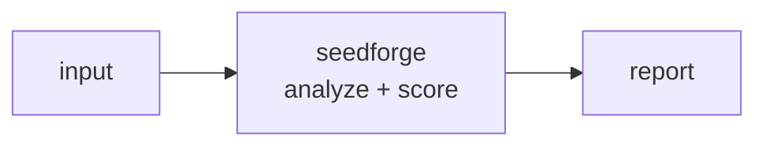

<a name="top"></a>

<div align="center">


# SEEDFORGE


### Synthetic test-data generator with referential integrity


[](https://pypi.org/project/cognis-seedforge/) [](https://github.com/cognis-digital/seedforge/actions) [](LICENSE) [](https://github.com/cognis-digital)


*Data & Datasets — zero-setup quality, lineage, and governance.*


</div>


```bash

pip install cognis-seedforge

seedforge scan .            # → prioritized findings in seconds

```


## Contents


- [Why seedforge?](#why) · [Features](#features) · [Quick start](#quick-start) · [Example](#example) · [Architecture](#architecture) · [AI stack](#ai-stack) · [How it compares](#how-it-compares) · [Integrations](#integrations) · [Install anywhere](#install-anywhere) · [Related](#related) · [Contributing](#contributing)


## Usage — step by step

`seedforge` generates deterministic synthetic data from a schema JSON, with optional referential-integrity verification. `verify` exits `1` when a foreign key fails to resolve.

1. **Install**
   ```bash
   pip install seedforge
   ```

2. **Generate data from a schema** (deterministic per `--seed`, default 0):
   ```bash
   seedforge gen schema.json
   ```

3. **Emit JSON and pin a seed** for reproducible fixtures:
   ```bash
   seedforge --format json gen schema.json --seed 42 > fixtures.json
   ```

4. **Verify referential integrity** — generates, then asserts every FK resolves:
   ```bash
   seedforge verify schema.json
   ```

5. **Use in CI** — `verify` returns non-zero on broken references, so a bad schema fails the build:
   ```bash
   seedforge --format json verify schema.json | jq '.broken_refs'
   seedforge verify schema.json || exit 1
   ```

<a name="why"></a>

## Why seedforge?


dev + data crossover, viral


`seedforge` is single-purpose, scriptable, and self-hostable: point it at a target, get prioritized results in the format your workflow already speaks (table · JSON · SARIF), gate CI on it, and let agents drive it over MCP.


<div align="right"><a href="#top">↑ back to top</a></div>


<a name="features"></a>

## Features


- ✅ Generate

- ✅ Verify Integrity

- ✅ Runs on Linux/macOS/Windows · Docker · devcontainer

- ✅ Ports in Python, JavaScript, Go, and Rust (`ports/`)


<div align="right"><a href="#top">↑ back to top</a></div>


<a name="quick-start"></a>

## Quick start


```bash

pip install cognis-seedforge

seedforge --version

seedforge scan .                       # scan current project

seedforge scan . --format json         # machine-readable

seedforge scan . --fail-on high        # CI gate (non-zero exit)

```


<div align="right"><a href="#top">↑ back to top</a></div>


<a name="example"></a>

## Example


```text

$ seedforge scan .

  [HIGH    ] SEE-001  example finding             (./src/app.py)

  [MEDIUM  ] SEE-002  another signal              (./config.yaml)


  2 findings · risk score 5 · 38ms

```


<div align="right"><a href="#top">↑ back to top</a></div>


<a name="architecture"></a>

## Architecture





<div align="right"><a href="#top">↑ back to top</a></div>


<a name="ai-stack"></a>

## Use it from any AI stack


`seedforge` is interoperable with every popular way of using AI:


- **MCP server** — `seedforge mcp` (Claude Desktop, Cursor, Cognis.Studio, [uncensored-fleet](https://github.com/cognis-digital/uncensored-fleet))

- **OpenAI-compatible / JSON** — pipe `seedforge scan . --format json` into any agent or LLM

- **LangChain · CrewAI · AutoGen · LlamaIndex** — wrap the CLI/JSON as a tool in one line

- **CI / scripts** — exit codes + SARIF for non-AI pipelines


<div align="right"><a href="#top">↑ back to top</a></div>


<a name="how-it-compares"></a>

## How it compares


| | **Cognis seedforge** | Faker |

|---|:---:|:---:|

| Self-hostable, no account | ✅ | varies |

| Single command, zero config | ✅ | ⚠️ |

| JSON + SARIF for CI | ✅ | varies |

| MCP-native (AI agents) | ✅ | ❌ |

| Polyglot ports (JS/Go/Rust) | ✅ | ❌ |

| Open license | ✅ COCL | varies |


*Built in the spirit of **Faker / Synth**, re-framed the Cognis way. Missing a credit? Open a PR.*


<div align="right"><a href="#top">↑ back to top</a></div>


<a name="integrations"></a>

## Integrations


Pipes into your stack: **SARIF** for code-scanning, **JSON** for anything, an **MCP server** (`seedforge mcp`) for AI agents, and a webhook forwarder for SIEM/Slack/Jira. See [`docs/INTEGRATIONS.md`](docs/INTEGRATIONS.md).


<div align="right"><a href="#top">↑ back to top</a></div>


<a name="install-anywhere"></a>

## Install — every way, every platform


```bash

pip install "git+https://github.com/cognis-digital/seedforge.git"    # pip (works today)

pipx install "git+https://github.com/cognis-digital/seedforge.git"   # isolated CLI

uv tool install "git+https://github.com/cognis-digital/seedforge.git" # uv

pip install cognis-seedforge                                          # PyPI (when published)

docker run --rm ghcr.io/cognis-digital/seedforge:latest --help        # Docker

brew install cognis-digital/tap/seedforge                             # Homebrew tap

curl -fsSL https://raw.githubusercontent.com/cognis-digital/seedforge/main/install.sh | sh

```


| Linux | macOS | Windows | Docker | Cloud |

|---|---|---|---|---|

| `scripts/setup-linux.sh` | `scripts/setup-macos.sh` | `scripts/setup-windows.ps1` | `docker run ghcr.io/cognis-digital/seedforge` | [DEPLOY.md](docs/DEPLOY.md) (AWS/Azure/GCP/k8s) |


<div align="right"><a href="#top">↑ back to top</a></div>


<a name="related"></a>

## Related Cognis tools


- [`duckprobe`](https://github.com/cognis-digital/duckprobe) — Zero-setup data-quality checks on any file or warehouse via DuckDB

- [`schemadrift`](https://github.com/cognis-digital/schemadrift) — Schema-change detector and data-contract tests

- [`csvlens`](https://github.com/cognis-digital/csvlens) — Fast CLI for profiling and cleaning huge CSV / Parquet files

- [`piiscan`](https://github.com/cognis-digital/piiscan) — PII discovery across warehouses and lakes (data-side scanner)

- [`lineagemap`](https://github.com/cognis-digital/lineagemap) — Column-level lineage extracted from SQL and dbt

- [`datasetcard`](https://github.com/cognis-digital/datasetcard) — Auto Dataset Cards / datasheets with Croissant + provenance


**Explore the suite →** [🗂️ all 170+ tools](https://github.com/cognis-digital/cognis-neural-suite) · [⭐ awesome-cognis](https://github.com/cognis-digital/awesome-cognis) · [🔗 cognis-sources](https://github.com/cognis-digital/cognis-sources) · [🤖 uncensored-fleet](https://github.com/cognis-digital/uncensored-fleet) · [🧠 engram](https://github.com/cognis-digital/engram)


<div align="right"><a href="#top">↑ back to top</a></div>


<a name="contributing"></a>

## Contributing


PRs, new rules, and demo scenarios are welcome under the collaboration-pull model — see [CONTRIBUTING.md](CONTRIBUTING.md) and [SECURITY.md](SECURITY.md).


> ### ⭐ If `seedforge` saved you time, **star it** — it genuinely helps others find it.


## Interoperability

`{}` composes with the 300+ tool Cognis suite — JSON in/out and a shared
OpenAI-compatible `/v1` backbone. See **[INTEROP.md](INTEROP.md)** for the
suite map, composition patterns, and reference stacks.

## License


Source-available under the **Cognis Open Collaboration License (COCL) v1.0** — free for personal, internal-evaluation, research, and educational use; **commercial / production use requires a license** (licensing@cognis.digital). See [LICENSE](LICENSE).


---


<div align="center"><sub><b><a href="https://cognis.digital">Cognis Digital</a></b> · one of 170+ tools in the <a href="https://github.com/cognis-digital/cognis-neural-suite">Cognis Neural Suite</a> · <i>Making Tomorrow Better Today</i></sub></div>

